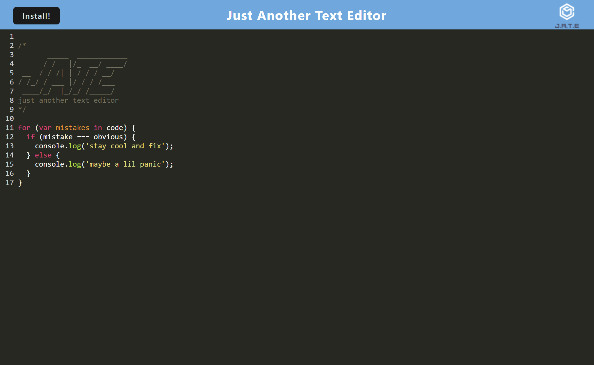
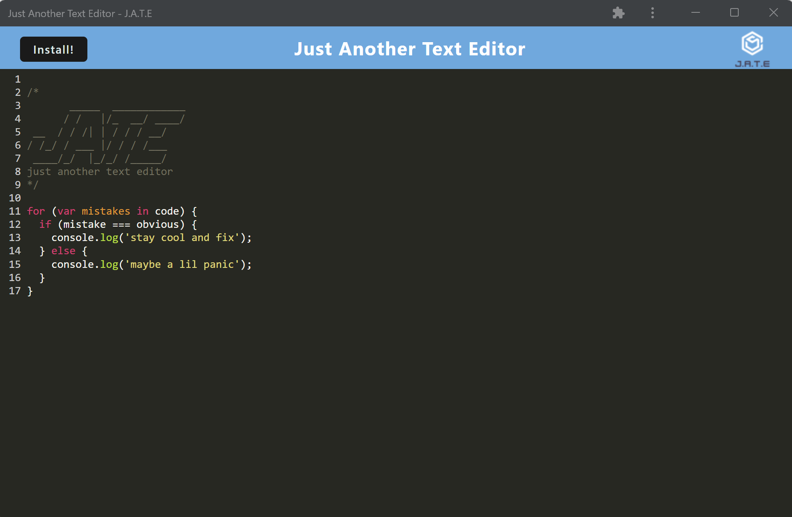

# Text Editor PWA

## Table of Contents
  - [Description](#description)
  - [Usage](#usage)
  - [Visuals](#visuals)
  - [Credits](#Credits)

## Description
[Link to deployed application](https://text-editor-pwa-cdh.herokuapp.com/)\
The Text Editor PWA is a website that can be downloaded as an app onto a users computer

## Usage
The editor works as you would think. Just a simple text editor. However, with it being a PWA you may download it as an app with the install button on the top left of the page.

If you wish to test the project you may clone the repo.\
Run `npm install` in your terminal to install all dependencies\
Then run `npm run build`\
Then run `npm run start:dev`\
In your browser go to [http://localhost:3000](http://localhost:3000) to use the application

## Visuals
Text Editor in Browser
\
Text Editor in App

## Credits
Christian Hoffman